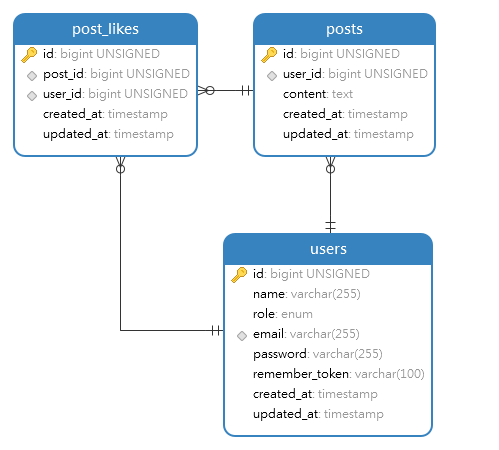
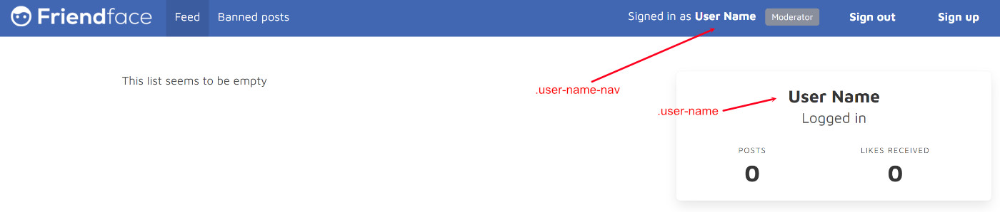

# Assignment 3: Friendface

In this assignment, you must implement a minimal version of a popular social network. We call this application: Friendface.

Friendface is an application where registered users can post, while other registered users can interact with these posts by giving them a *like*.

As with the previous assignments, you must follow the instructions **to the letter**. Your application will be tested automatically by the same system as the previous assignments. We provide you with a base application, where we already implemented some components. Your job is to implement the rest of the components by following our instructions.
**We understand the complexity of testing an assignment using an automatic tool. If you believe the tool is wrongly assessing your assignment, you should come to us so we can fix the problem.**

This assignment can be done individually or in groups of two people. Because of the time constraint of the assignment and [pair programming practices](https://en.wikipedia.org/wiki/Pair_programming), we heavily encourage you to work in groups. To create groups, you have to use the group feature in our automatic testing application (*ie,* it is unnecessary to create groups in itslearning). If you want to work in pairs but you do not know anyone else in the course who wants that, you can use the dedicated channel in Discord to look for a partner.

**Disclaimer:** Unless otherwise instructed, do not in any way, modify the contents of the `/tests` directory or the `.gitlab-ci.yml` file. Doing so will be considered cheating, and will in the best case result in your assignment being failed.

## Setup

1. Clone your project locally.
2. Run `composer install` to install php dependencies.
3. Create a copy of the .env.example file named .env. You can done this with the command `cp .env.example .env`
4. Run `php artisan key:generate` to generate a random encryption key for your application
5. Run `php artisan serve` to boot up your application

### The project

In this assignment, we give you an already coded application, where you have to fill up the gaps in the source code. This means it is not necessary for you to create any file, although you can create files if you think they are needed for your application to pass the tests. The different files you need to modify to pass this assignment are listed in its correspondent section.

### The database

The project requires a connection to a database. Luckily, thanks to docker, this is extremely simple and platform agnostic. To spin up a MySQL server, simply run the `docker-compose up -d` within the directory. This will pull a MySQL server, port-forward it to port 3306 on your machine, and start it in detached mode.

Additionally, we have included an installation of _phpmyadmin_ that you can use to explore the database (this will start as part of the docker command), simply go to [http://localhost:8036](http://localhost:8036) and you should see something like this:

(if the database is empty, you haven't migrated it yet)

You are of course still free to use whichever tool you prefer.

The connection to the database is defined as follows:
- host: `localhost`
- port: `3306`
- username: `root`
- password: `secret`
- database: `adoption`

If you followed the steps mentioned earlier and copied your `.env.example` to `.env`, then Laravel should already be configured with the correct connection details.

_Hint: your JetBrains Student subscription comes bundled with __DataGrip__, which can be used to explore your database._

### Relevant commands

- `php artisan migrate` - This will synchronize your database structure to your migrations (read more [here](https://laravel.com/docs/8.x/migrations#introduction)), these can be viewed under `database/migrations`. Laravel comes bundled with some by default, which you can either ignore or delete.
- `php artisan migrate:fresh` - Deletes everything within your database and starts the migration from scratch, very useful during development.
- `php artisan migrate:fresh --seed` - Deletes everything within your database and starts the migration from scratch, and seeds the database with some dummy data.
- `php artisan make:controller {name of Controller}` - This creates a controller with a specified name. Controllers in Laravel use a singular noun with the `Controller` suffix (HomeController, UserControler... e.g.)
- `php artisan make:model {name of model}` - Creates a model with a specified name (usually singular (User, House, Apartment, Animal...))
- `php artisan make:model {name of model} -mr` - Allows us to create a model with a given name, as well as a controller for it and a migration.
- `php artisan serve` - Starts the development server for the application.

### Testing your solution

Every time you push your code to our source control (gitlab.sdu.dk), your code will be validated to see if it meets the requirements of this assignment. This can be slow, especially if other people are also doing it simultaneously (then you will most likely be put in a queue). To mitigate this, you can run your tests locally.

#### Running browser tests

You should run our browser tests using Laravel Dusk. The first time you run the tests on your machine, you will have to install the latest `Chrome` binaries; this can be done with the `php artisan dusk:chrome-driver` command (make sure you have the latest version of chrome).

In another terminal, run `php artisan serve` - this is needed as dusk actively uses the server to test your implementation. Make sure the server is up and running every time you test your implementation.

In your main terminal, run: `php artisan dusk` and `php artisan test` - this will start running your tests.

## Logic

### Base application

As we mentioned, you are given a base application to work with. This application should be modified as instructed. In the original application, users can:
1. See a list of posts.
2. Give like to a post.
3. Delete their posts.

The application has three models: User, Post, and PostLike. Currently, User is used to creating posts and knowing which user is giving a like to a post. The Post model contains the necessary information about a post. The PostLike model is the presentation of a pivot table ([for more information](https://en.wikipedia.org/wiki/Associative_entity)) between User and Post. This is due there is a many-to-many relationship between User and Post. You can see the ER diagram of the database here:

We also provided two controllers: Home and Post. The Home controller is in charge of the Home page (of course) and the authentication logic (sign in, sign up, etc). The Post controller is in charge of all the Post logic. You need to modify these controllers as instructed.

### Route overview

The following routes are created for the pet shelter application:

| URL                 | Method | Controller     | Description                                                                  |
|---------------------|--------|----------------|------------------------------------------------------------------------------|
| /                   | GET    | HomeController | Shows the homepage                                                           |
| log-out             | GET    | HomeController | Logs the authenticated user out                                              |
| login               | POST   | HomeController | Logs the supplied user in if the credential matches                          |
| register            | GET    | HomeController | Shows the registration page where guests can sign up                         |
| register            | POST   | HomeController | Logic that creates the user from the input passed from the registration form |
| posts               | POST   | PostController | Creates a new post                                                           |
| posts/{post}        | DELETE | PostController | Deletes a given post                                                         |
| posts/{post}/like   | POST   | PostController | Likes a given post                                                           |
| post/{post}/dislike | POST   | PostController | Dislikes a given post                                                        |                            |

## Tasks / Tests

In Friendface, there are 3 different types of users: guests (not logged in), users, and moderators. For each type, your web application will behave differently.

To extend the base application, we provide several files that you should modify. For each task, we give the use case that is going to be tested and the files you should modify/extend to complete the task.

### 1. [Guest] Feed
Guest users are not authenticated into the system, therefore they cannot interact with posts. However, they still can see all the posts saved in the application.

#### Use case
1. They access the home of your app via the route `/`
2. On this page, they see a list of all the posts created by users.
3. Guest users cannot create posts, due to this, on this same page, they do not see the *Share an update* section (which is used to create posts).

#### Files to modify

`resources/views/home.blade.php`
On this page, we added a section to create posts. While registered users can create posts, guest users should not. This section should not appear for guest users.

*Important:* We provide the necessary code to show the feed for guest users. For this, we use pagination: https://laravel.com/docs/8.x/pagination

#### Tests

- `php artisan dusk --filter testCaseGuestOne` - Verifices that guests are unable to see the "Share an update" section

### 2: [Guest] Registration

Any user can register to the Friendface application.

#### Use case

1. They access the home of your app via the route `/`
2. They click the HTML element with class `register-link`. This action takes them to the registration form.
3. They input the following information: name, email, password, and confirm password. Each HTML form element should have the following classes respectively: `name`, `email`, `password`, `password-confirmation`.
    - The email field should have the `email` type.
    - The password and password-confirmation fields should be input fields with `password` type.
4. Click on a button to submit the information to your application. This button should have the class `register-submit`.
5. The system registers and automatically authenticates the user. _Hint:_ remember to store passwords as hashes.
6. The system redirects the authenticated user to the home route `/`.

#### Files to modify

`resource/views/partials/navbar.blade.php`
In HTML tag with class `register-link`, you should add the link that routes to the action `HomeController::register`. We already provide the route in the `routes/web.php` file.

`resource/views/partials/register.blade.php`
On this page, you have to add the fields for the registration form, the button to submit the form, and routing the submission of the form to the right link. The submission should point to the action `HomeController::doRegister`. We provide the route in the corresponding file. *Hint:* remember CSRF protection.

`app/Http/Controllers/HomeController.php`
The action to show the registration form is already implemented for you: `register`. For this task, you should implement the action `doRegister`, which is in charge to validate fields, creating the user, authenticating the user, and redirecting her to the right page. *Hint:* You can use the statement `auth()->login($user)` to authenticate a user.

#### Tests

- `php artisan dusk --filter testCaseGuestTwo` - tries to create a user through your registration page

### 3: [Guest] Login

Guest users should log in to Friendface to use the application. To do this, they should follow the next steps:

#### Use case

1. They access the home of your application via the route `/`. Here they can see the login form.
2. Input the following information: email and password. Each HTML form element should have the following classes respectively: `email` and `password`.
    - The email field should be an input field with the `email` type.
    - The password field should be an input field with the `password` type.
3. Click on the submit button to submit the form to your application. This button should have the class `login-submit`.
4. The system authenticates the user and redirect her to the home route `/`.

#### Files to modify

`resource/views/partials/login.blade.php`
On this page, you have to add the fields for the login form, the button to submit the form, and routing the submission of the form to the right link. The submission should point to the action `HomeController::doLogin`. We provide the route in the corresponding file.

`app/Http/Controllers/HomeController.php`
For this task, you should implement the action `doLogin`, which is in charge to validate fields, authenticating the user, and redirecting her to the home page.

#### Tests

- `php artisan dusk --filter testCaseGuestThree` - Attempts to login a user using your login form on the homepage

### 1: [User] Check if user is authenticated

When an authenticated user enters the home of your application, `/`, her name should appear in several places. This shows the user that they are already authenticated into the system.

#### Use case

1. When accessing the home of your app, the name of the authenticated user should appear as `$name` within 2 HTML tags, one with class `user-name` and another with class `user-name-nav`, as denoted in the picture below:
    * 
    * This should not appear for guest users
2. There is a section in the home of your application with information about the authenticated user. This section should only appear when users are authenticated.
3. There is a section in the home of your application with a form to log in a user. This section should not appear with authenticated users. It should appear only for guest users.
4. Due to the user is authenticated, the link to register a new user should not be accessible.

#### Files to modify

`resource/views/partials/logged-in.blade.php`
The HTML tag with class `user-name` shows the name of the authenticated user.

`resource/views/partials/navbar.blade.php`
The HTML tag with class `user-name-nav` shows the name of the authenticated user and should not appear for guest users. Moreover, the link to register a new user should not appear for authenticated users. For guests this should be hidden.

`resource/views/home.blade.php`
In this view, there are 2 partials defined `partials.logged-in` and `partials.login`. The first one should only appear when a user has been authenticated. The second one should only appear for guest users.

#### Tests

- `php artisan dusk --filter testCaseUserOne` - Tests the registration link and login panels are hidden when logged in. Also tests if the users name is shown in the navigation bar.

### 2: [User] Logout

Logged-in users should be able to log out of your system.

#### Use case

1. Go to the home page `/`.
2. Click the link/button to log out with class `logout-link`.
    * This link should not be accessible by guest users.
4. The system logged out the user and redirects her to the home page.

#### Files to modify

`resource/views/partials/navbar.blade.php`
In the HTML tag with class `logout-link`, you should add the link that routes to the action `HomeController::logout`. We provide the route in the corresponding file. This link should not be accessible by guest users.

`app/Http/Controllers/HomeController.php`
For this task, you should implement the action `logOut`, which is in charge of logging out the user and redirecting her to the right page.

#### Tests

- `php artisan dusk --filter testCaseUserTwo` attempts to log out the user

### 3: [User] Feed

Logged-in users can also see all posts from Friendface.

#### Use case

1. They access the home of your application via the route `/`
2. On this page, they see a list of all posts created by users.
3. Authenticated users can create posts. Due to this, on this same page, there is a *Share an update* section, which is used to create posts.

#### Files to modify

`resources/views/home.blade.php`
On this page, we added a section to create posts. The partial `create-post` should appear for authenticated users. In this assignment, we have already taken care of the logic to create posts.

*Important:* We provide the necessary code to show the feed for users. For this, we use pagination: https://laravel.com/docs/8.x/pagination

#### Tests

- `php artisan dusk --filter testCaseUserThree` checks if the feed is working as intended and showing up for users that are authenticated.

### 4: [User] Like post

Authenticated users can like posts. *Like* works similar to other social networks (*e.g.,* like button of Facebook).

#### Use case

1. Go to the home page `/`.
2. *Optional:* you need a post to like. You can create a post or use any other created post.
3. The user clicks on the link with class `like`.
4. After clicking on this link, the form to like the post is submitted.
5. The post is liked by the user. Then, the user is redirected to the home page. Here you can see that the post changed state to *liked*.

#### Files to modify

`resources/views/partials/feed-item.blade.php`
The form to like a post is contained in this partial. Here you need to add the right method and action to the form. The action of this form is linked to `PostController::like`. We provide the route in the corresponding file.

`app/Http/Controllers/PostController.php`
For this task, you should modify the action `like`. Here you should register that this post is liked by the authenticated user. We provide a pivot table `post_likes` for a many-to-many relationship between users and posts, you should save a *like* in this table. We recommend you to check: https://laravel.com/docs/8.x/eloquent-relationships#updating-many-to-many-relationships

#### Tests

- `php artisan dusk --filter testCaseUserFour` tests that the like link is visible within the posts and that the dislike button is visible afterwards.

### 5: [User] Dislike post

Authenticated users can dislike a liked post. In Friendface, a dislike refers to the ability to un-like a post.

#### Use case

1. Go to the home page `/`.
2. *Optional:* you need a liked post to dislike. You need to create a post and like it.
3. When a post is liked, the form to like a post should not be accessible.
4. In the same way, when a post has not been liked, the user should not be able to dislike the post. The form to dislike the post should be unavailable in this case.
5. The user clicks on the link with class `dislike`.
6. After clicking on this link, the form to like the post is submitted.
7. The post is un-liked by the user, then the user is redirected to the home page. Here you can see that the post changed from liked to non-liked.

#### Files to modify

`resources/views/partials/feed-item.blade.php`
The form to like a post is contained in this view. Here you need to add the right method and action to the form. The action of this form is linked to `PostController::dislike`. We provide the route in the corresponding file.

You also need to add and remove the like/dislike form depending on the state of the post. If the authenticated user has not liked the post, only the like form should appear. If the authenticated user has liked the post, only the dislike form should appear.

`app/Http/Controllers/PostController.php`
For this task, you should modify two actions `like` and `dislike`. In the `like` action, you should add that a liked post should not be able to be liked again by the same user. Be careful about this: a user can only like a post that has not been liked by him. If the user tries to like twice the same post, the action should do nothing, just redirect the user to the home.

For the `dislike` action, you should remove the like made by the registered user. This means, that the user does not like the post anymore. Similar to the `like` action, it does not make sense to dislike a post that has not been liked by the user. If the user tries to dislike a post that has not been liked by him, then this action does nothing, it just redirects the user to the home.

*Explanation:*
* A post can be liked by a user.
* Only post that has not been liked by the user, can be liked by her.
* A liked post can become non-liked if the user press *dislike*.
* Only liked posts by the user can be disliked by her (*i.e.,* a user cannot un-like a liked post from another user).
* It is possible that the same user *like*, *dislike*, and then *like* again a post. But it is not possible to *like* and *like* a post; or *dislike* and *dislike* a post by the same user. When a user *like*-*like* a post, the system only considers one *like*.

As with the previous task, we recommend you to check how to save and remove data in a many-to-many relationship: https://laravel.com/docs/8.x/eloquent-relationships#updating-many-to-many-relationships

#### Tests

- `php artisan dusk --filter testCaseUserFive` - likes multiple posts then checks that the like link is gone, and the dislike is present. Then it presses the dislike and check that the posts have reverted to their previous state showing a like link instead.

### 6: [User] Remove post

Users can remove posts that they created.

#### Use case

1. Go to the home page `/`.
2. Create a post.
3. Remove the post by pressing the link with the class `delete-post` associated with the created post.
4. User can only remove their posts, the link to remove a post from other users should not be shown.
5. After clicking on this link, the form to delete the post is submitted.
6. The post is deleted, and the web application redirects the user to the home page with the `success` flash message `The post was deleted`.

#### Files to modify

`resources/views/partials/feed-item.blade.php`
The form to delete a post is contained in this partial. Here you need to add the right method and action to the form. The action of this form is linked to `PostController::delete`. We provide the route in the corresponding file.

Moreover, this form should only appear for posts created by the authenticated user.

`app/Http/Controllers/PostController.php`
For this task, you should modify the action `delete`. In this action, you should remove the current post. Then, you should redirect to the home page with a flash message with the key `success` and the value `The post was deleted`.

#### Tests

- `php artisan dusk --filter testCaseUserSix` - creates multiple posts and deletes them, then another users tried to delete a post that doesn't belong to them, which should fail.

### 1: [Moderator] Check if logged in

Moderators are users with extra permissions in Friendface. A user can know if she is a moderator in our system.

The application adds a role to the User model: `standard` or `moderator`. You can see this in the migration file for the users table. For security reasons, you cannot just register a moderator in your application. To have a moderator user in the system, you can directly create a user with the role `moderator` using the terminal. You can also create a standard user and change its role to `moderator` in the terminal. Alternatively, you can also create a standard user and use the command `php artisan upgrade-user {mail}` to change the role of the user with mail `{mail}` to a moderator.

#### Use case

1. When a moderator accesses the home of your app, the text `Moderator` appears in an HTML element with class `moderator`, located in the header.
    * When a non-moderator user is authenticated, this element does not appear.

#### Files to modify

`resources/views/partials/navbar.blade.php`
The HTML element with class `moderator` should only appear if the authenticated user is a moderator.

#### Tests

- `php artisan dusk --filter testCaseModeratorOneModeratorUser` - validates that the moderator class is present for moderators
- `php artisan dusk --filter testCaseModeratorOneStandardUser` - validates that the moderator class is __not__ present for standard users

### 2: [Moderator] User features

Moderators have the same features as users. They can create, remove, and like posts.

#### Tests

All the tests of [User] tasks should work for [Moderator] users too.

`php artisan dusk --filter testCaseModeratorTwo` - validates that posts can be disliked and liked by moderators

### 3: [Moderator] Remove post

A moderator can remove any post from Friendface.

#### Use case

1. A standard user creates a post.
2. A moderator logs in.
3. She identifies the post and removes it by pressing the link with the class `delete-post` associated with that post.
    * Moderators can remove any post from any user, even other moderators.
5. After clicking on this link, the form to delete the post is submitted.
6. The post is deleted, and the web application redirects the user to the home page with the `success` flash message `The post was deleted`.

#### Files to modify

`resources/views/partials/feed-item.blade.php`
The form to delete a post is contained in this partial. Here you need to add the right method and action to the form. The action of this form is linked to `PostController::delete`. We provide the route in the corresponding file.

Unlike standard users, this form appears for any post created by any user.

`app/Http/Controllers/PostController.php`
For this task, you should modify the action `delete`. In this action, you should remove the current post. Then, you should redirect to the home page with a flash message with the key `success` and the value `The post was deleted`.

#### Tests

- `php artisan dusk --filter testCaseModeratorThree`  tests that a modertor is able to delete any post

### 1: [Authorization] Users permissions

In this assignment, we test the access of users and moderators to the different features of your application. For example, guest users are not allowed to post, and standard users cannot delete posts of other users. We present here the permission for the features of your application:

* Guest users can register, log in and see a list of posts.
* Guest users cannot interact with posts in any way: no like/dislike, no deleting.
* Standard users can log out, see a list of posts and interact with them.
* Standard users can interact with posts by liking any post and deleting the post they created.
* Moderator users have the same privileges as standard users, and more.
* The extra privileges of moderator users are: deleting any post.

Be careful, it is not enough to remove buttons, links, and/or forms from the application, but we should also restrict access to the different pages. Guest users may find the links and access them directly. You need to be very careful as we are going to test this too!

#### Files to modify

We are not going to impose a single way of completing this task. Nevertheless, we are going to list several files with examples of how you can solve this task.

In the view files, several elements should appear or disappear depending on the type of user accessing the application. You can use blade directives here: https://laravel.com/docs/8.x/blade#authentication-directives

`resources/views/home.blade.php`
* For guest users
    * available
        * the partial `login`
    * unavailable
        * creation of posts, partial `create-post`
        * the partial `logged-in`.
* For logged users
    * available
        * the partial `logged-in`
    * unavailable
        * the partial `login`.

`resources/views/partials/navbar.blade.php`
* For guest users
    *  available
        *  sign up link
    *  unavailable
        *  user name
        *  moderator text
        *  sign out link
* For standard logged users
    *  available
        *  user name
        *  sign out link
    *  unavailable
        * moderator text
        * sign up link
* For moderator logged users
    *  available
        *  user name
        *  moderator text
        *  sign out link
    *  unavailable
        * sign up link

`resources/views/partials/feed-item.blade.php`
* For guest users
    * available
        * post data
    *  unavailable
        * like and dislike links for any post
        * delete link for all posts
* For standard logged users
    * available
        * post data
        * like and dislike links for any post
        * delete link for post created by user
    * unavailable
        * delete link for posts created by other users
* For moderator logged users
    * available
        * post data
        * like and dislike links for any post
        * delete link for any post

`app/Policies/PostPolicy.php`
We created this policy for authorization purposes for Post objects. If you wish to use policies, you can add policy methods here. You can go back to the slides or look at the following link for more information: https://laravel.com/docs/8.x/authorization#creating-policies.

`app/routes/web.php`
If you decide to use policies for managing authorization, you can define the access to your routes using this policy as middleware (You can go back to the slides or look at the following link for more information: https://laravel.com/docs/8.x/authorization#via-middleware).

`app/Http/Controllers/*`
If you decide to use policies but do not want to use middleware, you can modify the controllers directly, via user helpers or controller helpers. ([https://laravel.com/docs/8.x/authorization#via-the-user-model](), [https://laravel.com/docs/8.x/authorization#via-controller-helpers]())

#### Tests

`php artisan test` tests if the user is unable to delete every post unless they are a moderator.
